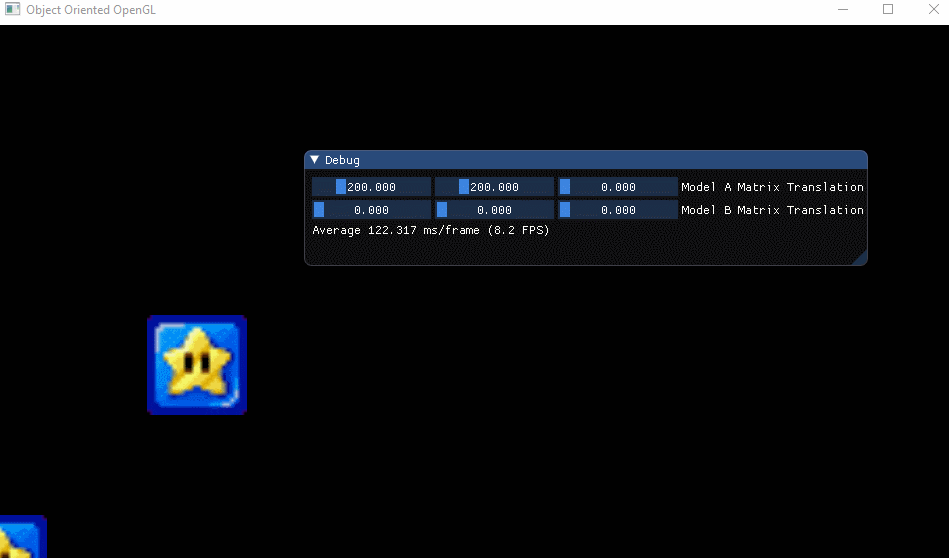

# OpenGL Playground

Implementing The Cherno.

# The foundation

Render
* Manages all

Memory
* Vertex Buffer
* Vertex Buffer Memory Layout
* Vertex Array
* Index Buffer

Graphics
* Shader
** Blending
* Textures

See wiki for more.
